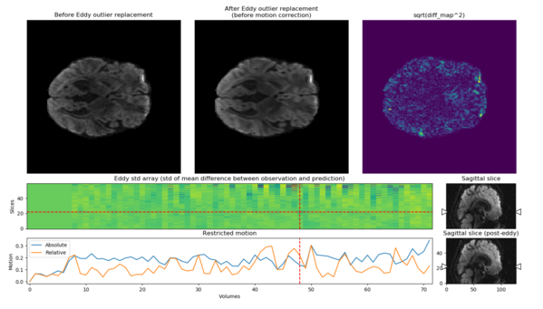
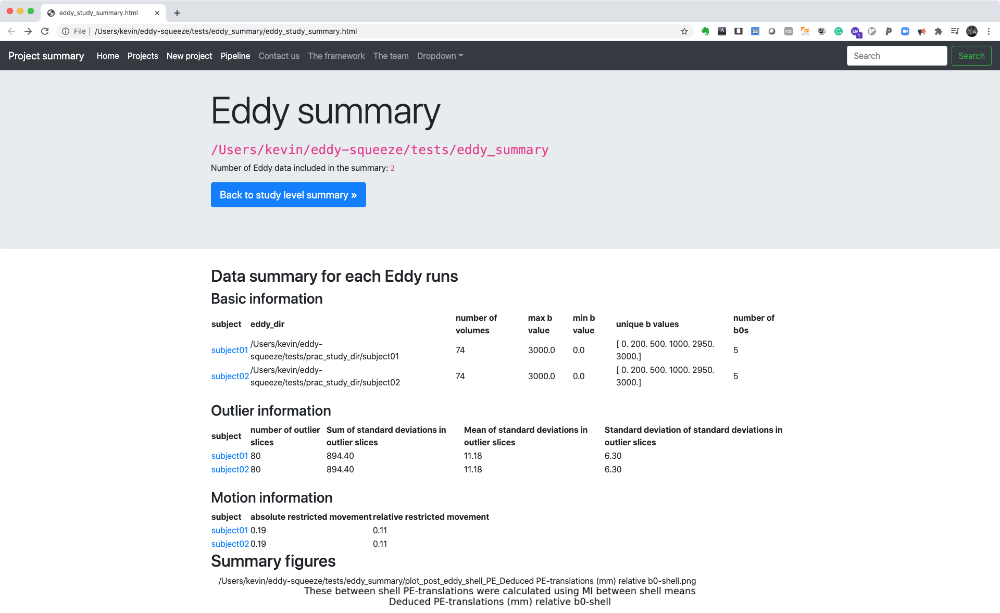
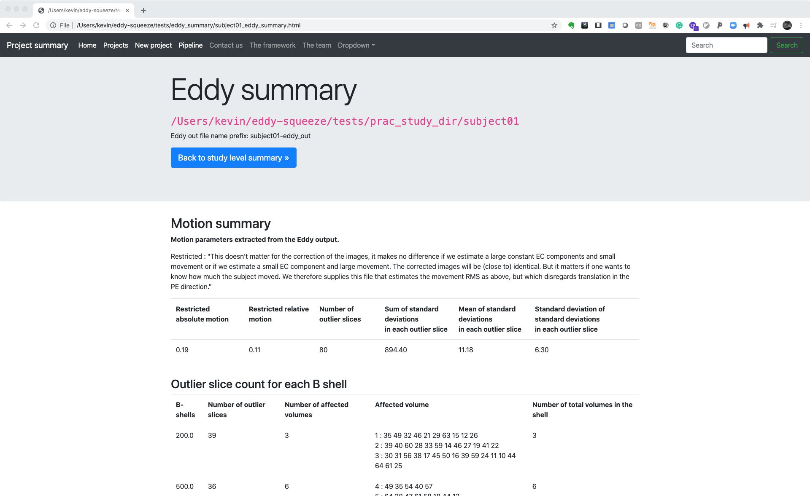

[](https://doi.org/10.5281/zenodo.3600531)


# eddy-squeeze

 


### Summarize and Visualize FSL Eddy Outlier Replacements





## Contents
- Introduction
- Installation
- Dependencies
- How to use the script


## Introduction


### eddy-squeeze

**eddy-squeeze is a tool that visualizes the signal replacements by FSL Eddy with `--repol` option.** In addition to the visualization, it also collects measures like motions, number of outliers and post-eddy translations rom multiple eddy outputs into a csv and html file, for easier QC of FSL Eddy outputs.

- Eddy QC interested users should also check out
    - *eddyqc* (`eddy_squad` and `eddy_quad`) by FSL that creates nice summary of a subject or a study wise summary of the Eddy outputs.
        - https://fsl.fmrib.ox.ac.uk/fsl/fslwiki/eddyqc/UsersGuide


### FSL Eddy

- Eddy is a eddy-current, and head movement correction tool, from FSL, for the diffusion weighted images (DWI).


#### Eddy outlier replacement

- Using a Gaussian Process, Eddy builds a model of DWI data for each shell. And using this model, the prediction of DWI data for different B-shells becomes available, which is then used to make a comparison to the acquired data.
- If the comparison between the predicted signal and the actual signal is larger than anticipated, Eddy marks the signal (the slice in the volume) an outlier.
- It can also replace the signals in the outlier slices with that of predicted signal, reducing the large deviations from these outliers.
    - Jesper L. R. Andersson and Stamatios N. Sotiropoulos. An integrated approach to correction for off-resonance effects and subject movement in diffusion MR imaging. NeuroImage, 125:1063-1078, 2016.
    - Jesper L. R. Andersson, Mark S. Graham, Eniko Zsoldos and Stamatios N. Sotiropoulos. Incorporating outlier detection and replacement into a non-parametric framework for movement and distortion correction of diffusion MR images. NeuroImage, 141:556-572, 2016.


<br><br>
## Installation

##### Download the repository

```sh
git clone https://github.com/pnlbwh/eddy-squeeze
```

##### Testing the eddy-squeeze using `pytest`

```sh
cd eddy-squeeze/tests
pytest test_eddy_squeeze.py

cd eddy-squeeze/tests/eddy_squeeze_lib
pytest test_eddy_files.py
pytest test_eddy_present.py
pytest test_eddy_utils.py
```

##### Testing the eddy-squeeze

```
cd eddy-squeeze/bin
./eddy_squeeze -h
```

<br>

## Dependencies

```py
FSL 6.0.1 EDDY outputs
FSLDIR in PATH
nifti-snapshot (https://github.com/pnlbwh/nifti-snapshot)
python 3.7
scipy==1.3.3
nibabel==2.4.0
numpy==1.16.2
pathlib2==2.3.3
matplotlib==3.0.3
tabulate==0.8.5
pytest
```


## How to run eddy-squeeze

#### Collect output measures created by Eddy and prints them on screen
```sh
# one eddy output
eddy_squeeze --eddy_directories /test/eddy_out --print_table

# two eddy outputs
eddy_squeeze --eddy_directories /test/eddy_out1 /test/eddy_out2 --print_table
```


#### Save html summary

```sh
eddy_squeeze --eddy_directories /test/eddy_out1 /test/eddy_out2 \
    --print_table \
    --save_html \
    --out_dir prac_eddy_summary
```


#### Save html summary with figures

```sh
eddy_squeeze --eddy_directories /test/eddy_out1 /test/eddy_out2 \
    --print_table \
    --save_html \
    --figure \
    --out_dir prac_eddy_summary
```

<br>

## Example outputs


```sh
eddy_squeeze \
    --eddy_directories /prac_study_dir/subject01 /prac_study_dir/subject02 \
    --print_table
```

```
Output directory : /Users/kevin/eddy-squeeze/tests/bin/prac_eddy_summary
--------------------------------------------------

Setting up eddy directories
--------------------------------------------------

Extracting information from all eddy outputs
--------------------------------------------------
Summarizing 3 subjects
There is no eddy related files in ../prac_study_dir/subject03

n=2 eddy outputs detected
--------------------------------------------------

Basic information
--------------------------------------------------
+----+-----------+----------------------------+---------------------+---------------+---------------+---------------------------------------+-----------------+
|    | subject   |              eddy_dir      |   number of volumes |   max b value |   min b value | unique b values                       |   number of b0s |
|----+-----------+----------------------------+---------------------+---------------+---------------+---------------------------------------+-----------------|
|  0 | subject01 |  /prac_study_dir/subject01 |                  74 |          3000 |             0 | [   0.  200.  500. 1000. 2950. 3000.] |               5 |
|  1 | subject02 |  /prac_study_dir/subject02 |                  74 |          3000 |             0 | [   0.  200.  500. 1000. 2950. 3000.] |               5 |
+----+-----------+----------------------------+---------------------+---------------+---------------+---------------------------------------+-----------------+

Outlier information
--------------------------------------------------
+----+-----------+----------------------------+------------------------------------------------+-------------------------------------------------+---------------------------------------------------------------+
|    | subject   |   number of outlier slices |   Sum of standard deviations in outlier slices |   Mean of standard deviations in outlier slices |   Standard deviation of standard deviations in outlier slices |
|----+-----------+----------------------------+------------------------------------------------+-------------------------------------------------+---------------------------------------------------------------|
|  0 | subject01 |                         80 |                                        894.399 |                                           11.18 |                                                       6.30107 |
|  1 | subject02 |                         80 |                                        894.399 |                                           11.18 |                                                       6.30107 |
+----+-----------+----------------------------+------------------------------------------------+-------------------------------------------------+---------------------------------------------------------------+

Motion information
--------------------------------------------------
+----+-----------+--------------------------------+--------------------------------+
|    | subject   |   absolute restricted movement |   relative restricted movement |
|----+-----------+--------------------------------+--------------------------------|
|  0 | subject01 |                       0.190404 |                       0.112074 |
|  1 | subject02 |                       0.190404 |                       0.112074 |
+----+-----------+--------------------------------+--------------------------------+

```


<br>

#### Save summary html

```sh
eddy_squeeze \
    --eddy_directories /test/eddy_out1 /test/eddy_out2
    --out_dir eddy_summary \
    --save_html
```
<br>



<br>



<br>
<br>

```sh
eddy_squeeze --eddy_directories /test/eddy_out1 /test/eddy_out2 --save_html --figure
```


