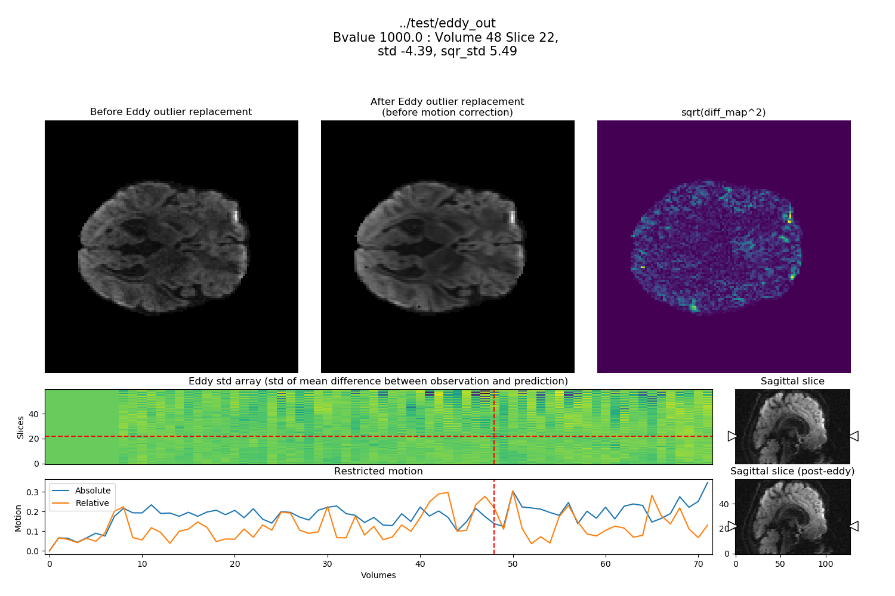

 

# eddy-squeeze

Visualize extra information from FSL eddy outputs

```py
git clone https://github.com/pnlbwh/eddy-squeeze
```


## Contents

- TODO
- Dependencies
- How to use the script


## TODO

- move plot functions to the nifti-snapshot
- more information from eddy outputs


## Dependencies

```py
FSL 6.0.1 EDDY outputs
FSLDIR in PATH
nifti-snapshot (https://github.com/pnlbwh/nifti-snapshot)
python 3.7
scipy==1.3.3
nibabel==2.4.0
numpy==1.16.2
pathlib2==2.3.3
matplotlib==3.0.3
```


## How to use the script


### Print motion (restricted) along with other eddy information

```shell

./eddy_squeeze --eddy_dir ../test/eddy_out -po

```


```shell
restricted_absolute_motion  restricted_relative_motion  number_of_outlier_slices  outlier_std_total  outlier_std_mean  outlier_std_std
0                    0.179872                    0.124634                        53          400.39664          7.554654         2.616683
                Volume  Slice      Stds  Sqr_stds  rank

Outlier slices
0                   47     56 -14.35350  38.53480     0
1                   41     57 -13.01630  34.95630     1
2                   46     57 -12.71290  33.66330     2
3                   47     58 -12.22440  39.22380     3
4                   46     55 -11.46380  29.26250     4
5                   56     55 -11.14510  23.23620     5
6                   41     55 -11.01860  21.39540     6
7                   47     54 -10.20930  21.62080     7
8                   57     56  -9.91693  19.79560     8
9                   51     56  -9.58872  19.85920     9
10                  53     55  -9.58179  15.73060    10
11                  56     57  -9.48110  15.70910    11
12                  64     57  -8.95525  14.31340    12
13                  64     55  -8.77195  13.54150    13
14                  33     56  -8.66030  14.11610    14
15                  53     53  -8.65345  13.33360    15
16                  66     57  -8.47718  17.60860    16
17                  65     52  -8.43979  21.60780    17
18                  47     52  -8.43364  20.26750    18
19                  25     56  -8.31707  16.72230    19
20                  51     58  -8.26085  16.33100    20
21                  56     53  -8.24303  18.00460    21
22                  48     57  -8.14592  16.64700    22
23                  47     50  -8.09716  18.92510    23
24                  65     50  -7.91556  18.84600    24
25                  61     56  -7.79518  14.29030    25
26                  53     57  -7.74794  10.99030    26
27                  36     55  -7.67407  12.38540    27
28                  36     57  -7.51060  11.60880    28
29                  65     54  -7.36123  12.12250    29
30                  53     51  -7.25939  14.14500    30
31                  62     44  -6.93178  16.83770    31
32                  57     54  -6.77710  10.85570    32
33                  25     52  -6.73062  12.48860    33
34                  66     55  -6.57132   9.55288    34
35                  39     45  -6.55768   8.46479    35
36                  33     58  -6.49373  11.84110    36
37                  57     58  -5.31691   7.15539    37
38                  61     58  -4.88429   6.36768    38
39                  68     57  -4.80080   4.67743    39
40                  43     57  -4.63532   3.86947    40
41                  65     48  -4.55496   4.42666    41
42                  43     55  -4.53226   4.62069    42
43                  44     56  -4.46189   3.35124    43
44                  64     53  -4.46001   3.86975    44
45                  46     53  -4.43432   6.07274    45
46                  48     22  -4.39074   5.49077    46
47                  44     58  -4.18749   4.05597    47
48                  65     46  -4.06953   4.31454    48
49                  48     55  -4.05850   3.87897    49
50                  25     54  -4.05688   5.12469    50
51                  56     51  -4.04159   5.84227    51
52                  46     51  -4.01692   5.64939    52
```


### Study-wise summary of the eddy outputs

```shell

./eddy_squeeze_study -ed /study/path/subject*/eddy

```

#### Example output


|    | subject   |   number of volumes |   max b value |   min b value | unique b values                       |   number of b0s |   number of outlier slices |   Sum of standard deviations in outlier slices |   Mean of standard deviations in outlier slices |   Standard deviation of standard deviations in outlier slices |   absolute restricted movement |   relative restricted movement |   absolute movement |   relative movement |
|----|-----------|---------------------|---------------|---------------|---------------------------------------|-----------------|----------------------------|------------------------------------------------|-------------------------------------------------|---------------------------------------------------------------|--------------------------------|--------------------------------|---------------------|---------------------|
|  0 | subject_353c  |                  74 |          3000 |             0 | [   0.  200.  500. 1000. 2950. 3000.] |               5 |                         75 |                                        800.62  |                                        10.6749  |                                                       5.67277 |                       0.405855 |                       0.230262 |            0.653026 |            0.467002 |
|  1 | subject_309c  |                  74 |          3000 |             0 | [   0.  200.  500. 1000. 2950. 3000.] |               5 |                         62 |                                        585.877 |                                         9.44962 |                                                       5.26578 |                       0.728763 |                       0.112724 |            0.822696 |            0.412796 |
|  2 | subject_316c  |                  74 |          3000 |             0 | [   0.  200.  500. 1000. 2950. 3000.] |               5 |                         60 |                                        523.487 |                                         8.72478 |                                                       5.05003 |                       0.830369 |                       0.305694 |            0.952818 |            0.497189 |
|  3 | subject_369c  |                  74 |          3000 |             0 | [   0.  200.  500. 1000. 2950. 3000.] |               5 |                         58 |                                        580.126 |                                        10.0022  |                                                       5.76787 |                       0.345985 |                       0.159334 |            0.583275 |            0.739979 |
|  4 | subject_306c  |                  74 |          3000 |             0 | [   0.  200.  500. 1000. 2950. 3000.] |               5 |                         58 |                                        525.028 |                                         9.05221 |                                                       4.55145 |                       0.675001 |                       0.217329 |            0.801741 |            0.590544 |
|  5 | subject_275c  |                  74 |          3000 |             0 | [   0.  200.  500. 1000. 2950. 3000.] |               5 |                         54 |                                        508.574 |                                         9.41803 |                                                       4.52075 |                       0.59835  |                       0.271036 |            0.729778 |            0.509582 |
|  6 | subject_346c  |                  74 |          3000 |             0 | [   0.  200.  500. 1000. 2950. 3000.] |               5 |                         53 |                                        623.438 |                                        11.763   |                                                       5.57189 |                       0.444441 |                       0.50271  |            0.611553 |            0.647743 |
|  7 | subject_327c  |                  74 |          3000 |             0 | [   0.  200.  500. 1000. 2950. 3000.] |               5 |                         52 |                                        482.541 |                                         9.27963 |                                                       5.47736 |                       0.536185 |                       0.201369 |            0.652559 |            0.437693 |
|  8 | subject_330c  |                  74 |          3000 |             0 | [   0.  200.  500. 1000. 2950. 3000.] |               5 |                         51 |                                        427.729 |                                         8.38685 |                                                       4.72738 |                       0.838054 |                       0.711922 |            0.937807 |            0.827304 |
|  9 | subject_380c  |                  74 |          3000 |             0 | [   0.  200.  500. 1000. 2950. 3000.] |               5 |                         49 |                                        495.493 |                                        10.1121  |                                                       5.20017 |                       0.277204 |                       0.276305 |            0.490699 |            0.464468 |
| 10 | subject_356c  |                  74 |          3000 |             0 | [   0.  200.  500. 1000. 2950. 3000.] |               5 |                         49 |                                        386.715 |                                         7.89214 |                                                       3.56298 |                       0.313836 |                       0.247726 |            0.55314  |            0.448548 |
| 11 | subject_382c  |                  74 |          3000 |             0 | [   0.  200.  500. 1000. 2950. 3000.] |               5 |                         48 |                                        467.252 |                                         9.73441 |                                                       4.55383 |                       0.49855  |                       0.476861 |            0.707215 |            0.645792 |
| 12 | subject_390c  |                  74 |          3000 |             0 | [   0.  200.  500. 1000. 2950. 3000.] |               5 |                         48 |                                        415.73  |                                         8.66105 |                                                       3.69977 |                       0.69139  |                       0.375211 |            0.8808   |            0.557656 |
| 13 | subject_366c  |                  74 |          3000 |             0 | [   0.  200.  500. 1000. 2950. 3000.] |               5 |                         46 |                                        492.029 |                                        10.6963  |                                                       5.86241 |                       0.533993 |                       0.219982 |            0.900398 |            0.44777  |
| 14 | subject_348c  |                  74 |          3000 |             0 | [   0.  200.  500. 1000. 2950. 3000.] |               5 |                         46 |                                        399.719 |                                         8.68954 |                                                       4.87194 |                       0.581433 |                       0.202079 |            0.85255  |            0.536305 |
| 15 | subject_337c  |                  74 |          3000 |             0 | [   0.  200.  500. 1000. 2950. 3000.] |               5 |                         46 |                                        370.601 |                                         8.05655 |                                                       3.53425 |                       0.406464 |                       0.287782 |            0.578558 |            0.471198 |
| 16 | subject_328c  |                  74 |          3000 |             0 | [   0.  200.  500. 1000. 2950. 3000.] |               5 |                         45 |                                        340.209 |                                         7.5602  |                                                       3.02455 |                       0.597634 |                       0.251481 |            0.766497 |            0.449481 |
| 17 | subject_319c  |                  74 |          3000 |             0 | [   0.  200.  500. 1000. 2950. 3000.] |               5 |                         44 |                                        468.956 |                                        10.6581  |                                                       6.17388 |                       0.54597  |                       0.299992 |            0.681012 |            0.504038 |
| 18 | subject_355c  |                  74 |          3000 |             0 | [   0.  200.  500. 1000. 2950. 3000.] |               5 |                         43 |                                        443.771 |                                        10.3203  |                                                       9.83506 |                       0.509205 |                       0.585631 |            0.718594 |            1.00102  |
| 19 | subject_385c  |                  74 |          3000 |             0 | [   0.  200.  500. 1000. 2950. 3000.] |               5 |                         41 |                                        385.717 |                                         9.40772 |                                                       4.56538 |                       0.543152 |                       0.329574 |            0.814912 |            0.646694 |
| 20 | subject_391c  |                  74 |          3000 |             0 | [   0.  200.  500. 1000. 2950. 3000.] |               5 |                         40 |                                        352.819 |                                         8.82046 |                                                       3.94894 |                       1.05907  |                       0.271684 |            1.216    |            0.492617 |
| 21 | subject_383c  |                  74 |          3000 |             0 | [   0.  200.  500. 1000. 2950. 3000.] |               5 |                         40 |                                        322.465 |                                         8.06163 |                                                       4.30027 |                       0.556208 |                       0.262022 |            0.721456 |            0.47402  |
| 22 | subject_376c  |                  74 |          3000 |             0 | [   0.  200.  500. 1000. 2950. 3000.] |               5 |                         38 |                                        302.046 |                                         7.94857 |                                                       4.30204 |                       0.460199 |                       0.105408 |            0.71092  |            0.406367 |
| 23 | subject_342c  |                  74 |          3000 |             0 | [   0.  200.  500. 1000. 2950. 3000.] |               5 |                         34 |                                        346.755 |                                        10.1987  |                                                       4.98559 |                       0.639239 |                       0.252866 |            0.8151   |            0.469087 |
| 24 | subject_393c  |                  74 |          3000 |             0 | [   0.  200.  500. 1000. 2950. 3000.] |               5 |                         32 |                                        295.534 |                                         9.23543 |                                                       5.09952 |                       0.544043 |                       0.141259 |            0.699966 |            0.408502 |
| 25 | subject_290c  |                  74 |          3000 |             0 | [   0.  200.  500. 1000. 2950. 3000.] |               5 |                         31 |                                        325.604 |                                        10.5034  |                                                      12.6606  |                       0.319165 |                       0.202098 |            0.56414  |            0.397606 |
| 26 | subject_339c  |                  74 |          3000 |             0 | [   0.  200.  500. 1000. 2950. 3000.] |               5 |                         25 |                                        209.692 |                                         8.38768 |                                                       3.17967 |                       1.78852  |                       0.257643 |            1.88947  |            0.467267 |
| 27 | subject_354c  |                  74 |          3000 |             0 | [   0.  200.  500. 1000. 2950. 3000.] |               5 |                         25 |                                        206.05  |                                         8.24199 |                                                       3.86739 |                       0.344085 |                       0.433602 |            0.67667  |            0.638682 |
| 28 | subject_389c  |                  74 |          3000 |             0 | [   0.  200.  500. 1000. 2950. 3000.] |               5 |                         24 |                                        188.711 |                                         7.86294 |                                                       4.57546 |                       0.662831 |                       0.181419 |            0.884099 |            0.409103 |
| 29 | subject_364c  |                  74 |          3000 |             0 | [   0.  200.  500. 1000. 2950. 3000.] |               5 |                         24 |                                        186.64  |                                         7.77667 |                                                       3.52995 |                       0.419198 |                       0.188447 |            0.764077 |            0.424308 |
| 30 | subject_378c  |                  74 |          3000 |             0 | [   0.  200.  500. 1000. 2950. 3000.] |               5 |                         20 |                                        143.657 |                                         7.18285 |                                                       3.52692 |                       0.860107 |                       0.360584 |            1.09319  |            0.58848  |
| 31 | subject_367c  |                  74 |          3000 |             0 | [   0.  200.  500. 1000. 2950. 3000.] |               5 |                         17 |                                        103.621 |                                         6.09538 |                                                       2.71522 |                       0.737561 |                       0.213888 |            0.867543 |            0.436459 |


### Jupyter notebook

```py
from eddy_squeeze import kcho_eddy
eddy_pattern = '/path/to/study/subjects*/eddy'
eddyStudy = kcho_eddy.EddyStudy(eddy_pattern)
eddyStudy.clean_up_data_frame()

eddyStudy.df.sort_values(
    ['number of outlier slices', 'Sum of standard deviations in outlier slices', 
     'absolute restricted movement', 'relative restricted movement'],
    ascending=False
).drop(['ep', 'eddy_dir', 'unique b values', 'eddy_input'], axis=1).reset_index().drop('index', axis=1)


eddyStudy.df.groupby(['number of volumes', 'max b value', 'min b value', 'number of b0s']).count()['subject'].to_frame()
eddyStudy.get_unique_bvalues()
eddyStudy.figure_post_eddy_shell_PE()
eddyStudy.figure_post_eddy_shell()
eddyStudy.plot_subjects('absolute restricted movement')
eddyStudy.plot_subjects('relative restricted movement')
eddyStudy.plot_subjects('number of outlier slices')
eddyStudy.plot_subjects('Sum of standard deviations in outlier slices')
eddyStudy.plot_subjects('Mean of standard deviations in outlier slices')
eddyStudy.plot_subjects('Standard deviation of standard deviations in outlier slices')

```


### Save outlier slices as figures

```shell
./eddy_squeeze --eddy_directory ../test/eddy_out
```

or

```shell
./eddy_squeeze --eddy_directory ../test/eddy_out --out_dir eddy_out_test
```





